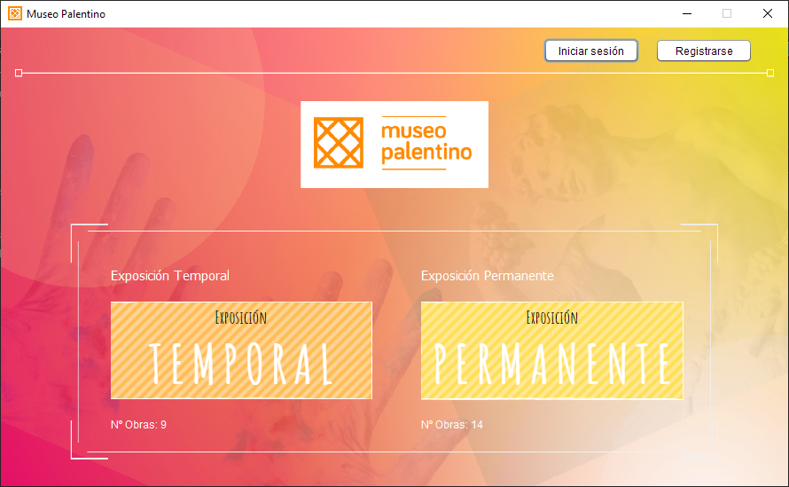

# MuseoPalentinoApp

Aplicación de un museo con funcionalidades diferentes para 3 roles: administrador, guía y cliente.



## Empezando
Este proyecto se trata de una aplicación de un museo al que tienen acceso los clientes, guías y administradores. La funcionalidad para los clientes es la de poder reservar entradas para poder acceder a una determinada exposición en nuestro supuesto museo ficticio. Por otro lado, los guías podrán visualizar los datos de los clientes a los que guiará en la exposición. Por último, los administradores, podrán visualizar todas las reservas realizadas por los clientes y administrar las exposiciones y las obras.

### Requisitos

Para poder trabajar con el programa puedes usar como IDE NetBeans o IntelliJ IDEA y como JDK el Java SE 8 o versiones superiores
```
NetBeans/IntelliJ IDEA
JDK SE 8+
```

### Instalación

1. Clone el repositorio desde GitHub a su equipo local.
El proyecto incluye 3 librerías para poder funcionar correctamente que son descargadas al clonar el repositorio.
* MYSQLDriver
* JCalendar
* AbsoluteLayout

El IDE debe reconocer automáticamente las 3 librerías, en caso de no ser así, importa manualmente las 3 librerías incluidas en la carpeta lib/ y añádelas a tu proyecto local

2. Importe la base de datos en su servidor local o remoto para que la aplicación funcione. La base de datos se encuentra en el directorio db/museopalentinoapp.sql

3. Asegúrese de que dispone del JDK con versión SE 8 o superior instalado en su equipo para poder ejecutar la aplicación:
Hay 2 archivos .JAR disponibles:
* **Versión 52.0 (Java SE 8)** - se encuentra en el directorio /dist/MuseoPalentinoApp.jar
* **Versión 56.0 (Java SE 12)** - se encuentra en el directorio /out/artifacts/MuseoPalentinoApp_jar/MuseoPalentinoApp.jar

Para poder arrancar la aplicación debe ejecutar uno de estos dos archivos. **Recuerde que para que la aplicación funcione debe tener instalado en su equipo la versión JDK 8 o superior**

## Autores

* **Víctor** - [VicBoss11](https://github.com/VicBoss11)
* **Álvaro** - [Alvhix](https://github.com/alvhix)
* **Guillermo** - [PonceDeNeon](https://github.com/PonceDeNeon)

## Licencia

MuseoPalentinoApp está licenciado bajo la

**GNU General Public License v3.0**

Los permisos de esta fuerte licencia copyleft están condicionados a que se ponga a disposición el código fuente completo de las obras y modificaciones licenciadas, que incluyen obras más grandes usando una obra licenciada, bajo la misma licencia. Los derechos de autor y los avisos de licencia deben ser preservados.
